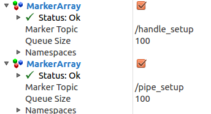

A marker array publisher for visualizing DRC valve layout in RViz.

1. clone the repository
2. cd into it
3. run `python publish_valve_layout.py`
4. Make sure you have a TF tree publisher that publishes the transform you want to visualize the valve layout in.
4. In RViz add a Marker Array visualization and select /handle_setup topic to see the valve handles.
5. In RViz add another Marker Array visualization and select /pipe_setup topic to see the pipes.

